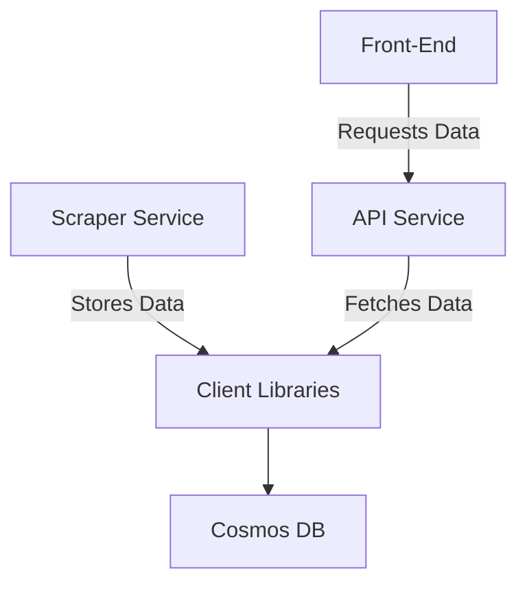

# Supermarket Scrape Tool

## Summary
The Supermarket Scrape Tool is a web application designed to enable users to compare prices and view the price history of supermarket products across different retailers, similar to kuantokusta.pt but focused on supermarket goods. This tool is intended to help consumers find the best deals and to provide insights into product pricing trends.

## Project Architecture


## Getting Started

### Running locally
1. Start the Azure Cosmos DB Emulator on Docker
    ```powershell
    docker-compose -f .\.development\compose.yaml up 
    ```
2. Copy the emulator's TLS/SSL certificate and install it in the Trusted Root Certification Authorities store
    ```powershell
    Invoke-WebRequest -Uri "https://localhost:8081/_explorer/emulator.pem" -OutFile "$env:USERPROFILE\emulatorcert.crt"
    ```
3. Navigate to `https://localhost:8081/_explorer/index.html` and create a new database called `SupermarketScrapeTool` with a container called `Products`
   > If you create with other names, also change on the file /.development/.secrets
4. Clone the project
5. Run `dotnet tool restore` and `dotnet paket install`
7. Run the project in Debug mode
   > The debug mode will use the `.secrets` file to connect to the Azure Cosmos DB Emulator

### [WIP] Running on the Cloud
- Azure CLI: you can install with Chocolatey `choco install azure-cli`
- Azure Cosmos DB

1. Clone the project
2. Run `dotnet tool restore`
3. Run `dotnet paket install`
4. Run `az login`

## Other Commands

### Pack a project

**Using UploadPackage.ps1** - builds, packs, and pushes the package to the GitHub Nuget Feed
```powershell 
.\UploadPackage.ps1 -ProjectName GNogueira.SupermarketScrapeTool.Models
```

**Manually**  
Pack all projects that have a paket.template file

```powershell
dotnet paket pack --version 1.0.0 nugets
```

or
Pack a specific project

```powershell
dotnet paket pack --template GNogueira.SupermarketScrapeTool.Models\paket.template --version 2.0.0-beta3 --symbols nugets
```

### How to add paket credentials to GitHub Nuget Feed

```powershell
dotnet paket config add-credentials https://nuget.pkg.github.com/g-nogueira/index.json --verify
```

It will then be asked for your GitHub username and password. The password should be a classic GitHub Access Token.

### Publish a package to GitHub Nuget Feed

```powershell
dotnet paket push nugets\GNogueira.SupermarketScrapeTool.Models.2.0.0-beta3.nupkg --url https://nuget.pkg.github.com/g-nogueira --api-key <GitHub-Access-Token>
```

### Login to Azure
We use the DefaultAzureCredential to authenticate with Azure. This will use the following methods to authenticate:
https://learn.microsoft.com/en-us/dotnet/api/azure.identity.defaultazurecredential?view=azure-dotnet

## Todo

- [x] Storage Service
- [x] Barebones Scrapper Service
- [x] Barebones API
- [ ] Barebones UI
- [ ] Add support for Lidl
- [ ] Add support for ALDI
- [ ] Add support for Auchan
- [ ] Make the clients create the container if it doesn't exist
